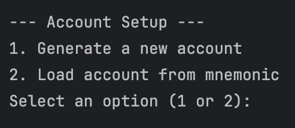
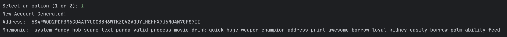
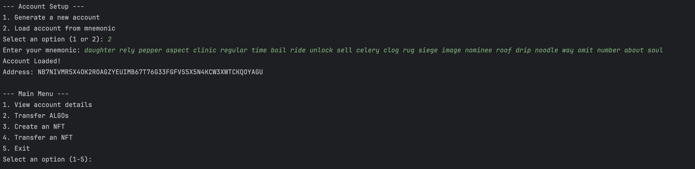
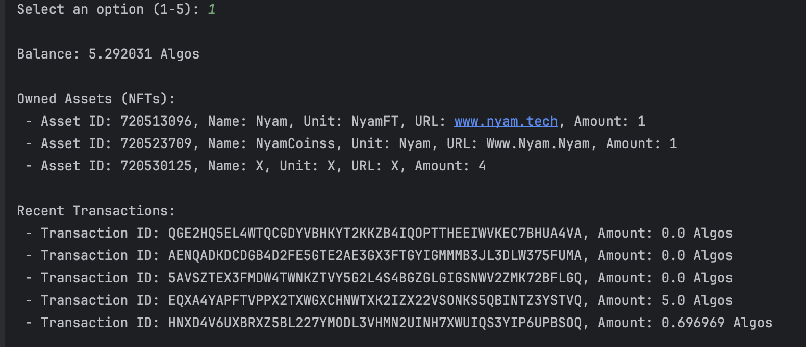
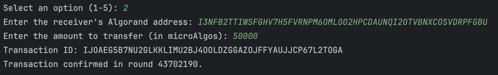
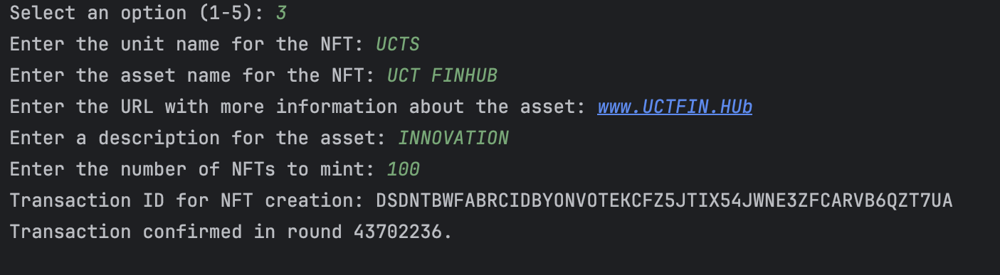
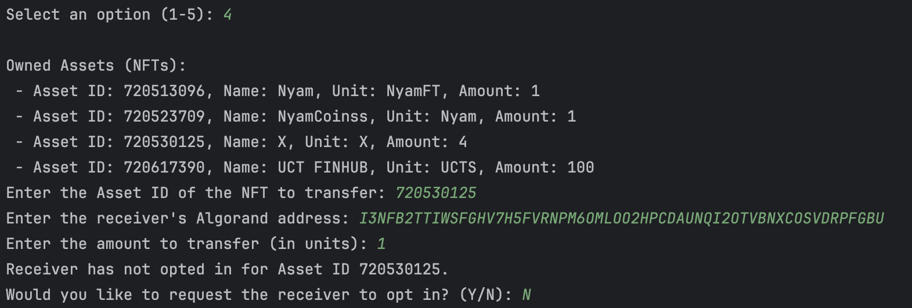

# Algorand CLI Application

## Overview

This Python Command-Line Interface (CLI) tool is designed for interacting with the Algorand blockchain on the Test Network. It provides functionalities for managing Algorand accounts, transferring ALGOs, creating and transferring NFTs (Algorand Standard Assets), and viewing account details. This application uses the Algonode service for blockchain interactions and does not require an API key.

## Features

### 1. Generate Algorand Account
- **Functionality**: Creates a new Algorand account.
- **Output**: Displays the public address, private key, and mnemonic phrase of the newly generated account.
- **Usage**: Ideal for users who need to create a new account for transactions or testing purposes.

### 2. Load Account from Mnemonic
- **Functionality**: Loads an existing Algorand account using a mnemonic phrase.
- **Output**: Displays the public address of the loaded account.
- **Usage**: Useful for users who already have an account and want to use it for transactions.

### 3. Transfer ALGOs
- **Functionality**: Transfers ALGOs from one account to another.
- **Output**: Displays the transaction ID for verification on the Algorand Test Network.
- **Usage**: Allows users to move funds between accounts for various purposes.

### 4. Create NFT (Algorand Standard Asset)
- **Functionality**: Creates a new NFT with specified parameters such as unit name, asset name, and URL.
- **Output**: Displays the transaction ID for NFT creation.
- **Usage**: Enables users to mint NFTs for use or testing.

### 5. Transfer NFT
- **Functionality**: Transfers NFTs from one account to another, with handling for asset opt-ins if necessary.
- **Output**: Displays the transaction ID for NFT transfer.
- **Usage**: Facilitates the transfer of NFTs between accounts.

### 6. View Account Details
- **Functionality**: Displays account balance, recent transactions, and owned NFTs.
- **Output**: Provides a detailed view of the account's financial and asset status.
- **Usage**: Useful for checking the status and history of an account.

## How It Works

### Account Setup

1. **Generate a New Account**
   - Initiates the process to generate a new Algorand account.
   - Displays the account’s public address, private key, and mnemonic phrase for future use.

2. **Load Account from Mnemonic**
   - Allows users to input a mnemonic phrase to load an existing account.
   - Displays the account’s public address once loaded.

### Main Menu

1. **View Account Details**
   - Provides a summary of the account’s balance, recent transactions, and owned NFTs.
   - Retrieves and displays account details using the Algod and Indexer clients.

2. **Transfer ALGOs**
   - Facilitates the transfer of ALGOs from one account to another.
   - Outputs the transaction ID and waits for confirmation to ensure successful processing.

3. **Create an NFT**
   - Guides the user through creating an NFT with custom parameters.
   - Outputs the transaction ID for NFT creation and waits for confirmation.

4. **Transfer an NFT**
   - Handles the transfer of NFTs between accounts.
   - Includes functionality for asset opt-ins if the receiver has not previously opted in.

5. **Exit**
   - Closes the application.

### Transaction Confirmation

- **Functionality**: Waits for the transaction to be confirmed on the blockchain.
- **Method**: Continuously checks the status of the transaction until confirmation or timeout.

## How to Run

1. **Install Dependencies**
   - Ensure you have Python installed. Install the required `algosdk` package using pip:
     ```sh
     pip install py-algorand-sdk
     ```

2. **Run the Application**
   - Execute the Python script:
     ```sh
     python main.py
     ```
   - Follow the prompts in the CLI to perform various operations.

## Screenshots

### Account Setup

*Shows the output after generating a new account.*

### Generating a New Account

*Shows the output after generating a new account.*

### Loading Account from Mnemonic

*Displays the result of loading an account using a mnemonic.*

### Viewing Account Details

*Shows account balance, recent transactions, and owned NFTs.*

### Transferring ALGOs

*Displays the transaction ID after transferring ALGOs.*

### Creating an NFT

*Shows the result of creating a new NFT.*

### Transferring an NFT

*Displays the transaction ID after transferring an NFT.*

## Contributing

Contributions are welcome! If you find any issues or have suggestions for improvements, please open an issue or submit a pull request.

## License

This project is licensed under the MIT License. See the [LICENSE](LICENSE) file for details.


